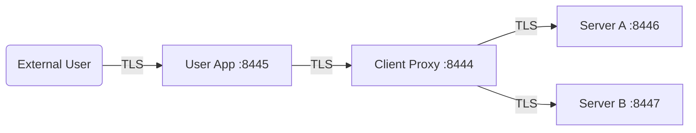
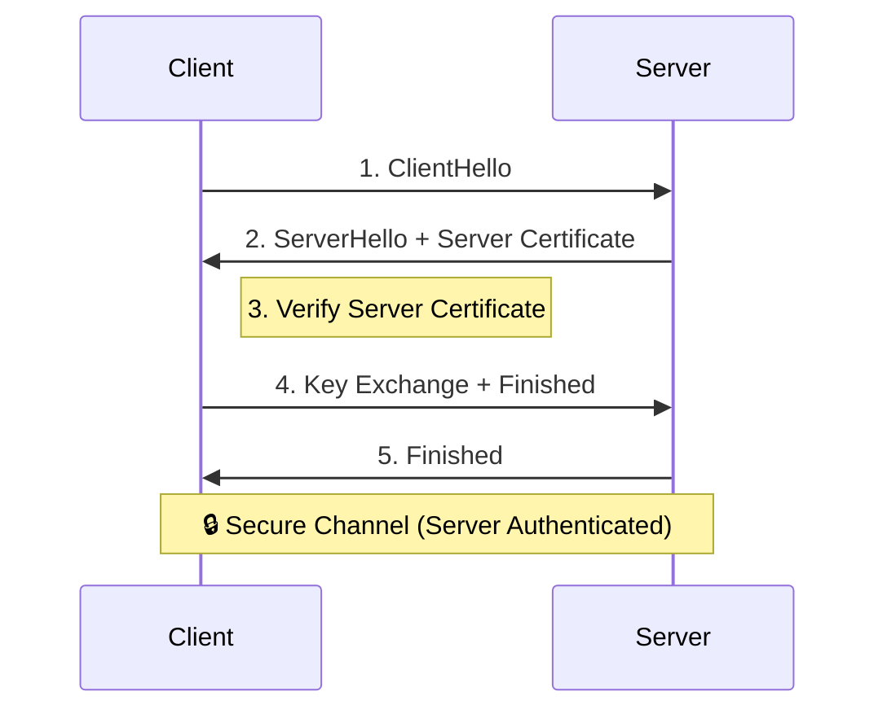
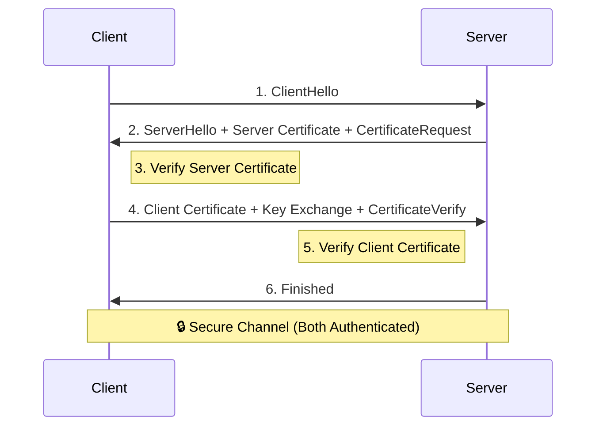

# Spring Boot TLS Multi-Server Inbound/Outbound TLS

This project demonstrates a complex TLS topology featuring two backend servers with distinct certificates, a central client proxy using a combined trust bundle, and an end-user application.

## 🏗 Architecture Topology



- **User App**: Acts as the entry point. Trusts the Client Proxy.
- **Client Proxy**: Calls both Server-A and Server-B in parallel. Trusts both via a combined PEM bundle.
- **Server-A / Server-B**: Discrete backend services with independent self-signed certificates.

---

## 🛠 Setup & Requirements

- **Java**: 17 or higher
- **Maven**: 3.8+
- **OpenSSL**: For certificate generation

---

## 🔐 1. Certificate Generation

The project uses self-signed certificates in PEM format. A bash script is provided to generate all necessary keys and create the combined trust bundle for the client.

```bash
# Run the key generation script
./generate-certs.sh
```

**What this script does:**
1. Generates `server-a.crt/key` with `CN=server-a.localhost`.
2. Generates `server-b.crt/key` with `CN=server-b.localhost`.
3. Concatenates both server certificates into `tls-client/src/main/resources/servers-trust.crt`.
4. (Optional) Existing `user.crt` and `client.crt` should already be present in their respective resources.

---

## 📦 2. Building the Project

The project is structured as a Maven multi-module build. 

```bash
# Clean and package all modules
mvn clean package -Dmaven.test.skip=true
```

This will produce executable JAR files in the `target` directory of each module:
- `tls-server-A/target/tls-server-A-0.0.1-SNAPSHOT.jar`
- `tls-server-B/target/tls-server-B-0.0.1-SNAPSHOT.jar`
- `tls-client/target/tls-client-0.0.1-SNAPSHOT.jar`
- `tls-user/target/tls-user-0.0.1-SNAPSHOT.jar`

---

## 🚀 3. Testing the Flow

A comprehensive test script automates the startup of all services and executes positive/negative tests.

```bash
# Execute the full TLS flow test
./test-tls-flow.sh
```

### Manual Verification
You can also verify the flow manually using `curl`:

```bash
# Hit the User App endpoint (requires user.crt for trust)
curl --cacert tls-user/src/main/resources/user.crt https://localhost:8445/test-full-chain
```

**Expected Response:**
`UserApp received: Server-A says: Hello from TLS Server-A! | Server-B says: Hello from TLS Server-B!`

---

## 📝 Key Configurations

### Combined Trust in Client
The `tls-client` loads multiple certificates from a single PEM file. See `TlsClientConfig.java`:

```java
// Netty HttpClient SslContext configuration
SslContext sslContext = SslContextBuilder.forClient()
    .trustManager(trustCertResource.getInputStream()) // loads everything in the PEM bundle
    .build();
```

### Parallel Dispatch
The `ClientProxyController.java` uses `Mono.zip` to coordinate the dual backend calls:

```java
public Mono<String> callServers() {
    return Mono.zip(callServerA(), callServerB())
               .map(tuple -> combineResponses(tuple.getT1(), tuple.getT2()));
}
```

---

## � TLS vs. Mutual TLS (mTLS)

This project has been upgraded from one-way TLS to **Mutual TLS (mTLS)**. Below is a comparison of how the handshake differs.

### 1. One-Way TLS (Standard)
In standard TLS, only the **server** proves its identity to the client. The client verifies the server's certificate against its trust store.



### 2. Mutual TLS (mTLS)
In mTLS, **both** the client and server prove their identities. The server sends a `CertificateRequest`, and the client must respond with its own certificate.



---

## 🛡️ Security Hardening

- [x] **Mutual TLS (mTLS)**: Enforced between Client Proxy and Backend Servers.
- [ ] **Private Certificate Authority (CA)**: Replace self-signed certificates.
- [ ] **Secrets Management**: Move private keys out of resources.
- [ ] **Certificate Rotation**: Automated renewal.
```
